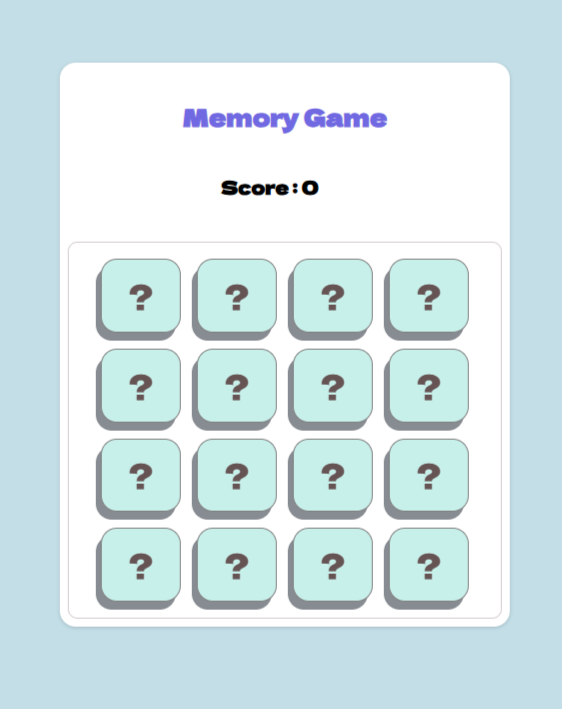

# Memory Game

After working with frameworks such as React for years, I wanted to revisit my core JavaScript skills. This memory game is one of the fun exercises I thought I could make.



[Play the Game](https://dastageer-hc.github.io/vanilla-js-memory-game/)

## Overview

This is a simple memory game created using **vanilla JavaScript**. The goal of the game is to match pairs of cards within a grid layout. Each card is hidden initially, and players must flip them over to find matching pairs. This project is designed for fun and to deepen my understanding of JavaScript and DOM manipulation. **Note: This project is currently a work in progress.**

## Features

- **Dynamic Card Generation**: Cards are generated dynamically using JavaScript.
- **4x4 Grid Layout**: The game features a 4x4 grid of cards.
- **Matching Logic**: Players can flip cards and check for matches.
- **Score Tracking**: The game keeps track of the player's score and the number of attempts.
- **Responsive Design**: The game is designed to work on various screen sizes.

## Technologies Used

- **HTML**: Structure of the game interface.
- **CSS**: Styling for the game layout and card designs.
- **JavaScript**: Game logic, event handling, and DOM manipulation (vanilla JS).

## Installation

To run the memory game locally, follow these steps:

1. **Clone the Repository**:
   ```bash
   git clone git@github.com:dastageer-hc/vanilla-js-memory-game.git
